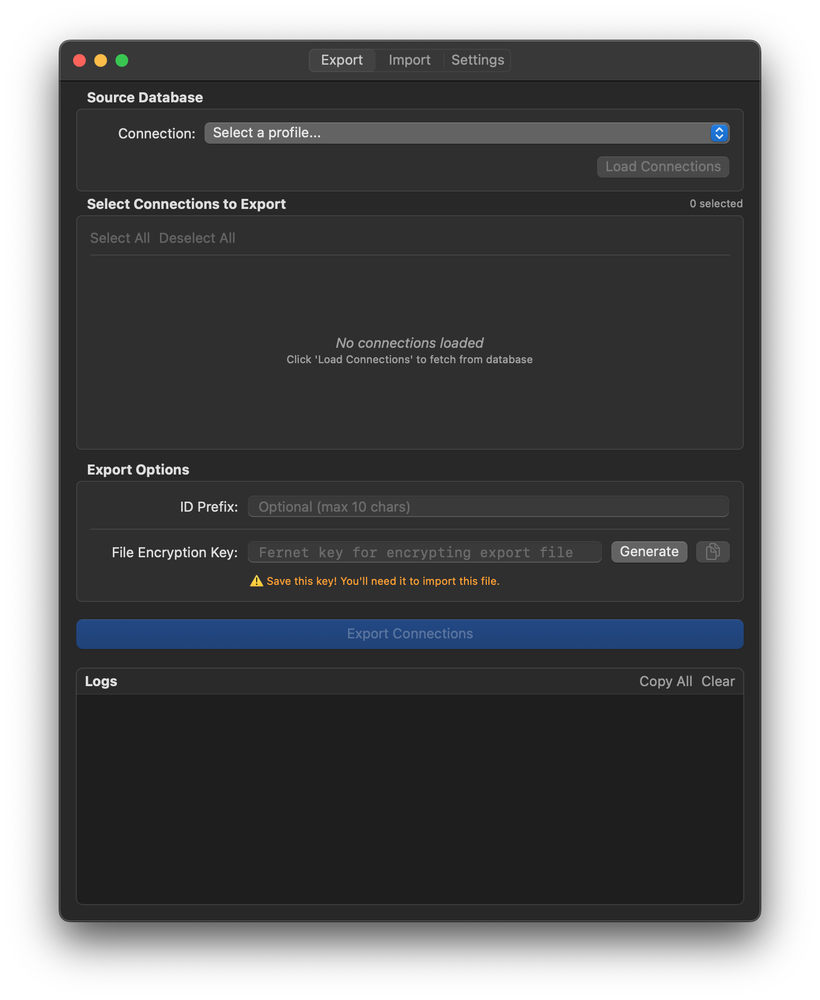
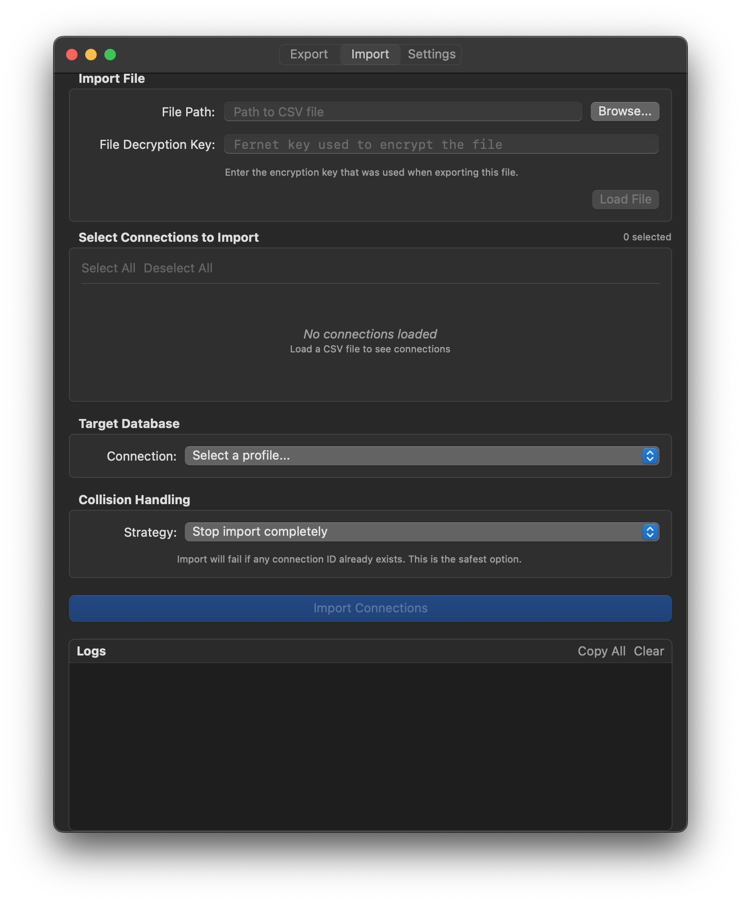
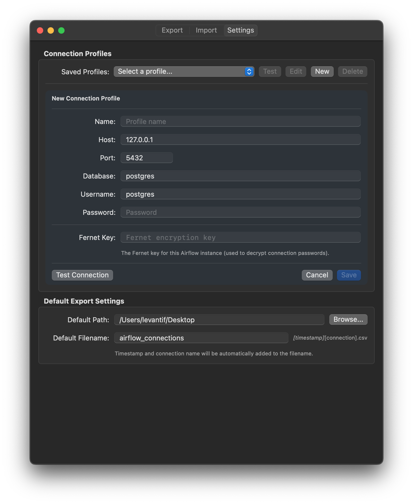

# Airflow Connection Migrator

A macOS application for securely exporting and importing Apache Airflow connection configurations between environments.

## Overview

Airflow Connection Migrator provides a native macOS GUI for managing Airflow database connections, enabling you to:
- Export connections from one Airflow instance to an encrypted CSV file
- Import connections to another Airflow instance with collision handling
- Manage connection profiles with secure Keychain storage
- Maintain consistent connection configurations across development environments

Perfect for DevOps teams managing multiple Airflow environments who need to synchronize connection configurations securely.

                            
## Screenshots

Click images to enlarge:

<table>
  <tr>
    <td align="center">
      <a href="README_images/export.png">
        
      </a>
      <br/>
      <b>Export View</b>
    </td>
    <td align="center">
      <a href="README_images/import.png">
        
      </a>
      <br/>
      <b>Import View</b>
    </td>
    <td align="center">
      <a href="README_images/settings.png">
        
      </a>
      <br/>
      <b>Settings View</b>
    </td>
  </tr>
</table>
                            
                            
                            
                            
## Features

### 🔐 Security First
- Fernet encryption compatible with Python's `cryptography.fernet`
- Secure credential storage using macOS Keychain
- Encrypted CSV files for safe connection sharing
- Support for URL-safe Base64 encoding

### 📤 Export Connections
- Select source Airflow database from saved profiles
- Choose specific connections to export with checkboxes
- Optional connection ID prefix to prevent collisions
- Generate encryption key or provide your own
- Native macOS save dialog

### 📥 Import Connections
- Load encrypted CSV files
- Preview connections before importing
- Three collision strategies:
  - **Stop completely**: Safest, aborts if any ID exists
  - **Skip existing**: Import only new connections
  - **Overwrite**: Replace existing connections (use with caution!)
- Real-time progress logging

### ⚙️ Connection Management
- Save database connection profiles
- Test connections before use
- Secure Fernet key storage per profile
- Default export paths and filenames

## Requirements

- macOS 13.0 or later
- Xcode 15.0+ (for building)
- Access to Airflow PostgreSQL metadata database
- Airflow Fernet encryption key

## Installation

### From Source

1. Clone the repository:
2. Open in Xcode:
3. Build and run (Cmd+R)

## Usage

### First-Time Setup

1. Launch the app
2. Go to **Settings** tab
3. Click **New** to create a connection profile
4. Enter your Airflow database credentials:
   - Name (e.g., "Local Dev", "Staging")
   - Host, Port, Database, Username, Password
   - Airflow Fernet Key (from your `airflow.cfg`)
5. Click **Test Connection** to verify
6. Click **Save**

### Exporting Connections

1. Go to **Export** tab
2. Select source connection profile from dropdown
3. Click **Load Connections**
4. Select which connections to export (checkboxes)
5. (Optional) Add connection ID prefix
6. Click **Generate** for file encryption key (save this key!)
7. Click **Export Connections**
8. Choose save location in the dialog

**Important:** Share the file encryption key separately from the CSV file!

### Importing Connections

1. Go to **Import** tab
2. Click **Browse** and select the encrypted CSV file
3. Enter the file encryption key
4. Click **Load File** to decrypt and preview connections
5. Select which connections to import
6. Select target connection profile
7. Choose collision handling strategy
8. Click **Import Connections**
9. Confirm the operation

## File Format

Exported CSV structure:
```csv
conn_id,encrypted_connection
team_db,gAAAAAB...
team_postgres_warehouse,gAAAAAB...
```

Each connection is encrypted as JSON with Fernet, containing:
- Connection ID, type, description
- Host, schema, login, password (encrypted)
- Port, extra configuration (encrypted if flagged)

Filename format: `airflow_connections_[timestamp]_[profile_name].csv`

## Architecture

Built with modern Swift and SwiftUI:
- **MVVM Architecture**: Clean separation of concerns
- **Async/Await**: Non-blocking database and file operations
- **SwiftUI**: Native macOS interface
- **Keychain Services**: Secure credential storage
- **PostgresNIO**: Async PostgreSQL client
- **SwiftFernet**: Python-compatible Fernet encryption

## Dependencies

- [SwiftFernet](https://github.com/flevanti/SwiftFernet) - Fernet encryption
- [PostgresNIO](https://github.com/vapor/postgres-nio) - PostgreSQL driver
- [CryptoSwift](https://github.com/krzyzanowskim/CryptoSwift) - Cryptographic operations

## Security Considerations

### Best Practices
- ✅ Store Fernet keys in password managers
- ✅ Use separate file encryption keys per export
- ✅ Share CSV files and keys through different channels
- ✅ Test connections before production imports
- ✅ Use "Stop completely" strategy by default
- ✅ Keep export files out of version control

### What's Stored Where
- **Keychain** (encrypted by macOS):
  - Database passwords
  - Airflow Fernet keys


## Contributing

Contributions welcome! Please:
1. Fork the repository
2. Create a feature branch
4. Submit a pull request

## Roadmap

Future enhancements being considered:
- [ ] Connections search and filtering
- [ ] Connection comparison tool
- [ ] Auto-backup before import

## License

Apache 2.0

## Acknowledgments

- Built with ❤️ for the Airflow community
- Inspired by the need for better DevOps tooling

## Support

Found a bug? Have a feature request? [Open an issue](https://github.com/flevanti/AirflowConnectionMigrator/issues)!

---

Made by a developer who got tired of manually copying connection configs 🚀
